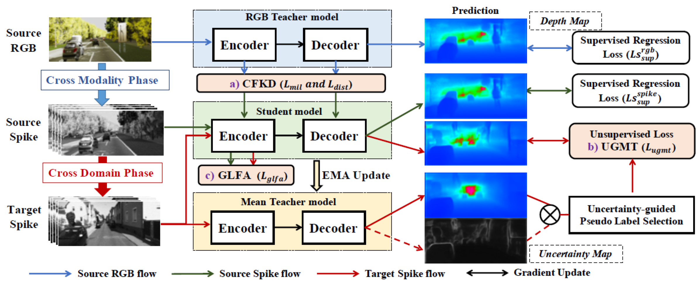
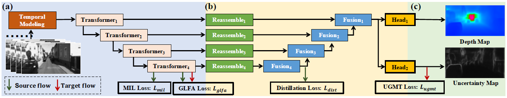
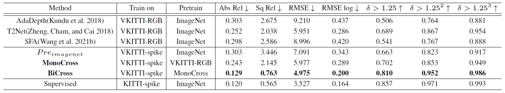
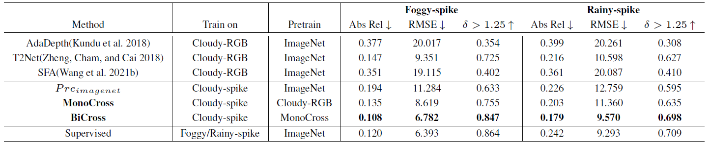
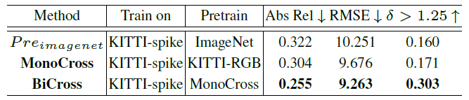
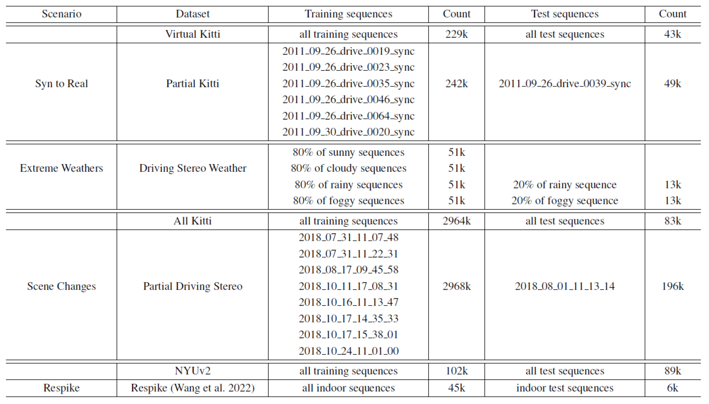
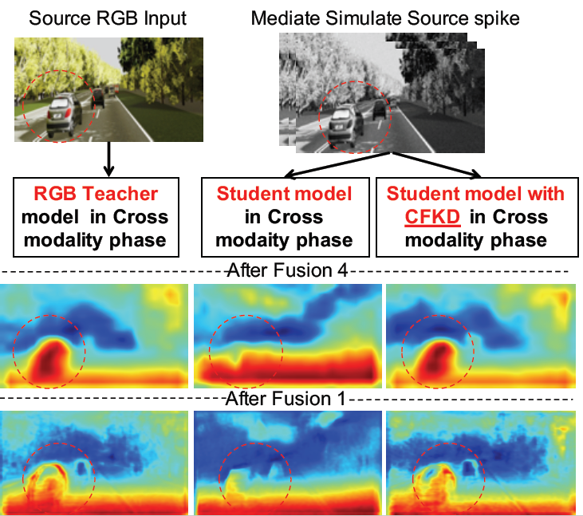
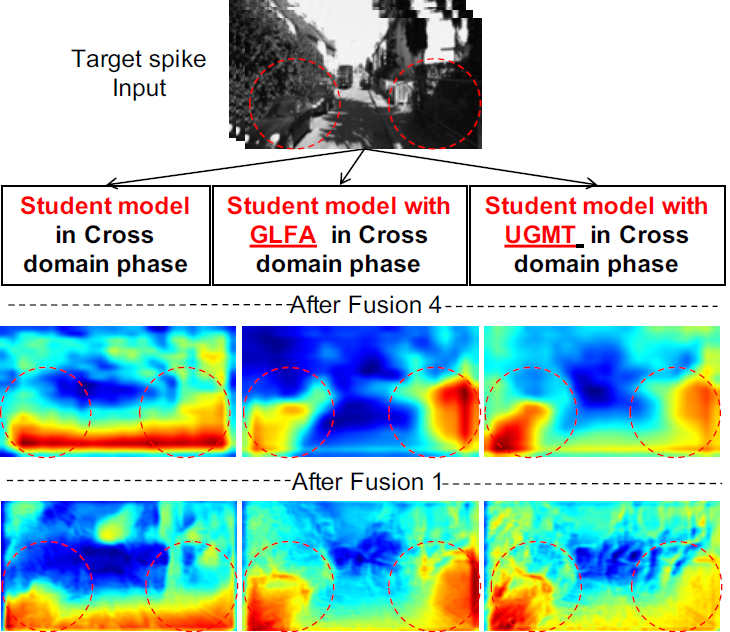
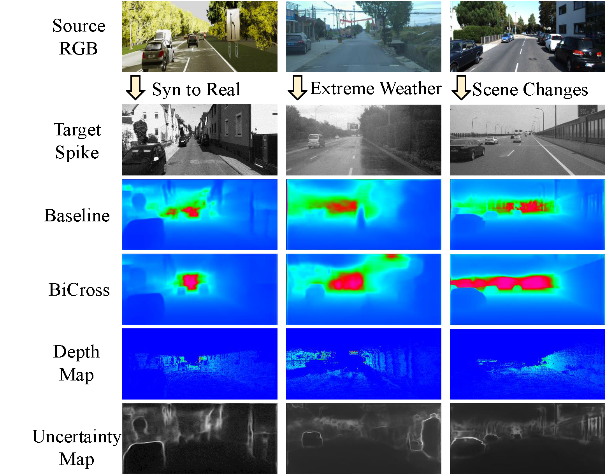
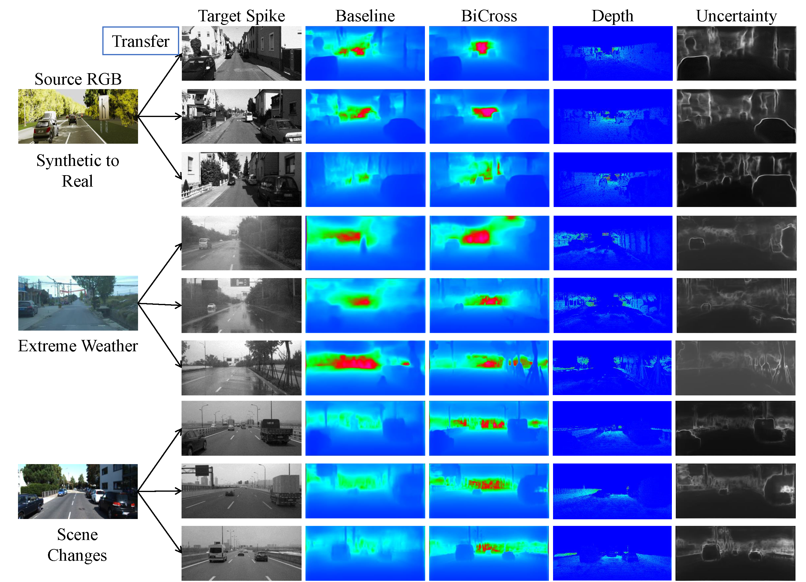

# BiCross - Unsupervised Spike Depth Estimation via Cross-modality Cross-domain Knowledge Transfer

## Architecture




## Result

### Synthetic to Real



### Extreme Weathers



### Scene Changes



## Usage

### Train the model via BiCross
```
python train.py
```

 - Training stages:
    1. Since the pretrained parameters of DPT are trained on the ImageNet, when you train from scratch, please first pretrain the model on the **source RGB** to adapt to the depth estimation task,, changing the `stage` option in the `train_config.json` to `pretrain` and training for about **30** epochs.
    2. After the pretrain stage, set `stage` in `train_config.json` to `crossmodality` and continue training for another **10** epochs from **source RGB** to **source spike**.
    3. Finally, set `stage` in `train_config.json` to `crossdomain` and then continue training for about **20** epochs from **source spike** to **target spike**.

### Test the trained model
```
python test.py
```

### Visualize the results
```
python visualize.py
```

You can modify the configs for different training and testing configurations.

## Datasets

### Detail



### Download

Coming soon (in Google Drive) !

## Visualization

### Cross-modality

The Coarse-to-Fine Knowledge Distillation (CFKD) module is proposed to transfer open-source RGB depth label and sufficient semantic knowledge to mediate simulated source spike domain. The global image-level branch and local pixel-level branch aim to replenish the sparse spatial-wise feature representation in spike and offer more feature-level information to align in cross-domain. With the help of CFKD, the semantic representation ability of spike features in different positions of the decoder is improved, showing similar results with RGB features.



### Cross-domain

The Global Level Feature Alignment (GLFA) module is proposed to exploit coarse branch (in CFKD) transferred global feature to coherent align in the cross-domain stage. Meanwhile, the Uncertainty Guided Mean-Teacher (UGMT) module adopts mean teacher mechanism to fully exploit the unlabeled target domain spike data, and uncertainty guided mechanism which abandons unreliable depth prediction to avoid error accumulation. With the help of both GLFA and UGMT, the perception and representation abilities of target spike data are improved.



### Qualitative Result

Here, we present the qualitative results of BiCross in three scenarios: Synthetic to Real, Extreme Weathers and Scene Changes.





## Demo


